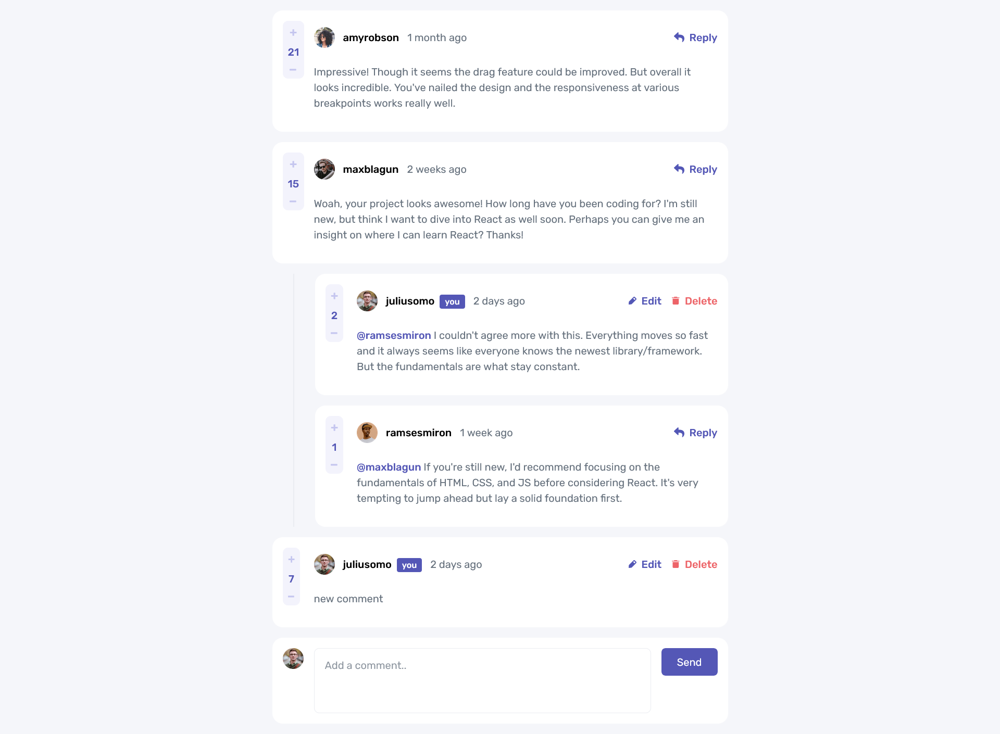

# Frontend Mentor - Interactive comments section solution

This is a solution to the [Interactive comments section challenge on Frontend Mentor](https://www.frontendmentor.io/challenges/interactive-comments-section-iG1RugEG9). Frontend Mentor challenges help you improve your coding skills by building realistic projects.

## Table of contents

- [Overview](#overview)
  - [The challenge](#the-challenge)
  - [Screenshot](#screenshot)
  - [Links](#links)
- [My process](#my-process)
  - [Built with](#built-with)
  - [What I learned](#what-i-learned)
  - [Continued development](#continued-development)
  - [Useful resources](#useful-resources)
- [Author](#author)

## Overview

### The challenge

Users should be able to:

- View the optimal layout for the app depending on their device's screen size
- See hover states for all interactive elements on the page
- Create, Read, Update, and Delete comments and replies
- Upvote and downvote comments
- **Bonus**: If you're building a purely front-end project, use `localStorage` to save the current state in the browser that persists when the browser is refreshed.
- **Bonus**: Instead of using the `createdAt` strings from the `data.json` file, try using timestamps and dynamically track the time since the comment or reply was posted.

### Screenshot



### Links

- Solution URL: [Add solution URL here](https://your-solution-url.com)
- Live Site URL: [Add live site URL here](https://your-live-site-url.com)

## My process

### Built with

- Semantic HTML5 markup
- CSS custom properties
- Flexbox
- CSS Grid
- Mobile-first workflow
- [React](https://reactjs.org/) - JS library
- [useLockBodyScroll](https://usehooks.com/) - React Custom from useHooks Library
- LocalStorage

### What I learned

In this challenge I learned how to use **localStorage** on handling the data provided with the resources. In this of handling it through the data.json file, I decided to push it to the localStorage to be familiarized using it for the next challenges

```js
const [comments, setComments] = useState(
  JSON.parse(localStorage.getItem("comments"))
);
```

One of my goals in this project is to apply some common hooks that I have learned from the past few days such as **useEffect**. I utilize useEffect hook by pushing the data.json at the first render if its not yet in there.

```js
useEffect(() => {
  if (!comments) {
    localStorage.setItem(
      "comments",
      JSON.stringify(data.comments.sort((a, b) => b.score - a.score))
    );
    setComments(JSON.parse(localStorage.getItem("comments")));
    console.log("no comments yet");
  }

  if (!currentUser) {
    localStorage.setItem("currentUser", JSON.stringify(data.currentUser));
    setCurrentUser(JSON.parse(localStorage.getItem("currentUser")));
    console.log("no user yet");
  }
}, [comments, currentUser]);
```

Using the logical && | AND operator is also a part of some new technique that I have applied for this project.

```js
{
  currentUser && <InputCard />;
}
```

Next thing, that I have applied is the `map` function to loop for all comments and replies in the localStorage.

```js
{
  comment.replies
    .sort((a, b) => b.score - a.score)
    .map((reply) => (
      <CommentCard
        key={reply.id}
        parentId={comment.id}
        commentItem={reply}
        isReply
      />
    ));
}
```

Finding the comment or reply object in the localStorage is not an easy thing to loop. In this scenario I have applied the `find` method to look for the existing commentId as props and the commentId in the localStorage

```js
comments
  .find((parent) => parent.id === parentId)
  .replies.find((reply) => reply.id === comment.id).score = commentScore;
```

THe workaround that I did to properly show the modal is to use the `useLocalBodyScroll` hook and setting the window position to top

```js
useLockBodyScroll();

useEffect(() => {
  window.scrollTo(0, 0);
});
```

### Continued development

For the future challenges I will continue to code using ReactJS with the new things I have learned. Soon I will be using NextJS for the future side projects that I will do.

### Useful resources

- [useLockBodyScroll](https://usehooks.com/uselockbodyscroll) - This is the hook I used for the delete modal.
- [updater function](https://react.dev/reference/react/useState#is-using-an-updater-always-preferred) - It explains the usage of updater function when using it for immediate state.

## Author

- Portfolio - [Project Portfolio](https://loifloro.github.io/portfolio/)
- Frontend Mentor - [@loifloro](https://www.frontendmentor.io/profile/loifloro)
- LinkedIn - [@jlfloro](https://www.linkedin.com/in/jlfloro/)

